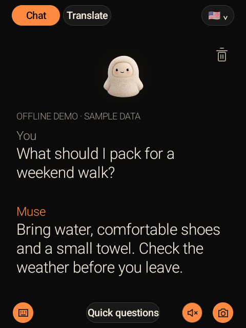
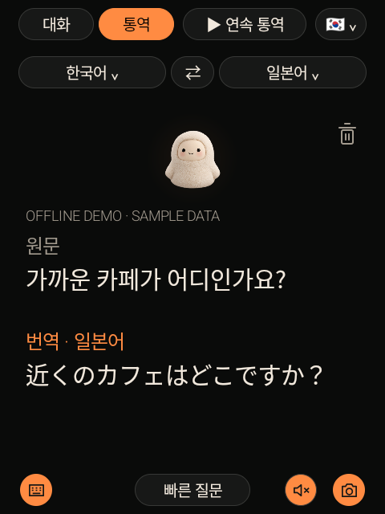
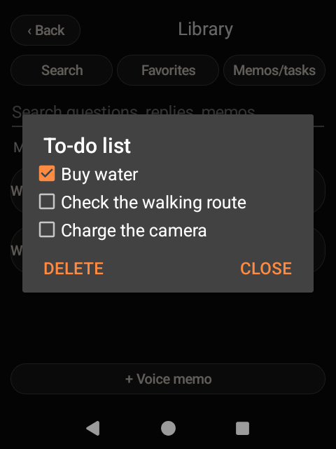

# MUSE Gadget for Rabbit r1

**[English guide](docs/en/GUIDE.md) · [한국어 가이드](docs/ko/GUIDE.md) · [日本語ガイド](docs/ja/GUIDE.md)**

A community Android Home app for a Rabbit r1 running LineageOS. Talk to Muse, interpret between Korean/Japanese/English, ask about photos, type messages, and keep a searchable local library.

Based on [Cameron Pak's muse-r1](https://github.com/cameronapak/muse-r1), snapshot [`c0dd741`](https://github.com/cameronapak/muse-r1/commit/c0dd741f0896f85540625d52be01750672e00eca). This repository contains the extended source and a documented installation journey. It is not an official Rabbit, Meta, ElevenLabs, or LineageOS project, and it is **not a custom ROM**.

<p align="center">
  
  
  
</p>

**Screenshots:** actual Android views captured on an r1 using a separate offline demo package. All conversations, translations, photo answers and tasks are fixtures, not live AI results. The demo has no Internet, microphone or camera permission. [Gallery and Discord captions](docs/SHOWCASE.md).

## Start here

| | English | 한국어 | 日本語 |
|---|---|---|---|
| Installation, setup, features, troubleshooting | [Guide](docs/en/GUIDE.md) | [가이드](docs/ko/GUIDE.md) | [ガイド](docs/ja/GUIDE.md) |
| Recovery case and development journey | [Journey](docs/en/JOURNEY.md) | [설치·개발 기록](docs/ko/JOURNEY.md) | [導入・開発記録](docs/ja/JOURNEY.md) |

- [Source map and data flow](docs/architecture.md)
- [Build, verification and demo capture](docs/development.md)
- [Privacy and security](SECURITY.md) · [Credits and asset license](CREDITS.md)

## Features

- Side-button push-to-talk; wheel + side-button media-volume control.
- Korean, Japanese and English interface; separate speech-input and translation-target controls.
- Sentence-by-sentence continuous interpretation, with visible start/stop controls.
- Optional ElevenLabs recognition and speech; Android TTS fallback when ElevenLabs is not configured.
- Camera capture, front/back switching, camera wheel routing, photo questions, text translation, and follow-up on the last photo.
- Keyboard input through the Android keyboard/IME; quiet mode; editable quick questions.
- Favorites, local conversation search, voice-to-text memos, reviewed memo-to-task checklists.
- Persistent conversation text size (18–26sp) and speech speed (0.75–1.5×).

## Build

Java 17, Android SDK platform 36, and network access for dependency downloads are required.

```sh
git clone https://github.com/youlim-bot/MUSE-Gadget-for-Rabbit-r1.git
cd MUSE-Gadget-for-Rabbit-r1
# Set ANDROID_HOME to your SDK directory, or use an ignored local.properties.
./gradlew :app:assembleDebug :app:testDebugUnitTest
adb install -r app/build/outputs/apk/debug/app-debug.apk
```

Keep your signing key stable. `install -r` preserves data only when Android accepts the package/signature; **do not uninstall a paired app to work around a signature mismatch**. No private signing key or prebuilt production APK is included.

## Verification boundaries

This is a community prototype tested on one LineageOS 21 / Android 14 Rabbit r1. The feature build passed 67 JVM tests and was installed with credentials preserved. The public export is built/tested separately; see [current checks](docs/development.md#public-export-checks). Photos and memo extraction still need end-to-end quality checks against your own Muse account. Camera front/back selection physically rotated the owner's unit; wheel behavior needs hands-on verification. Continuous interpretation is turn-based, not simultaneous streaming translation.

Firmware flashing wipes data and may prevent booting. Follow the guide's firmware/slot/fastbootd checks; never apply this unit's recovery state to another unit. Firmware images, stock backups, identifiers, credentials, personal screenshots and private avatar images are excluded.

한국어: LineageOS 설치부터 Muse 연결, 한국어·일본어·영어 통역, 사진 질문, 키보드, 메모·할 일까지 정리한 커뮤니티 프로젝트입니다. 위의 한국어 가이드에서 설치와 사용법을 확인하세요.

日本語: LineageOSの導入からMuseとの接続、韓国語・日本語・英語の通訳、写真への質問、キーボード、メモ・タスクまでをまとめたコミュニティプロジェクトです。日本語ガイドをご覧ください。

## License

First-party code/docs: [MIT](LICENSE), preserving Cameron Pak's notice. Vendored protocol and cryptography files retain their own licenses and provenance. The public build restores the original upstream Muse r1 avatar; the illustration is not covered by the code MIT license. Private dolphin/reference images are not distributed. See [CREDITS](CREDITS.md).
