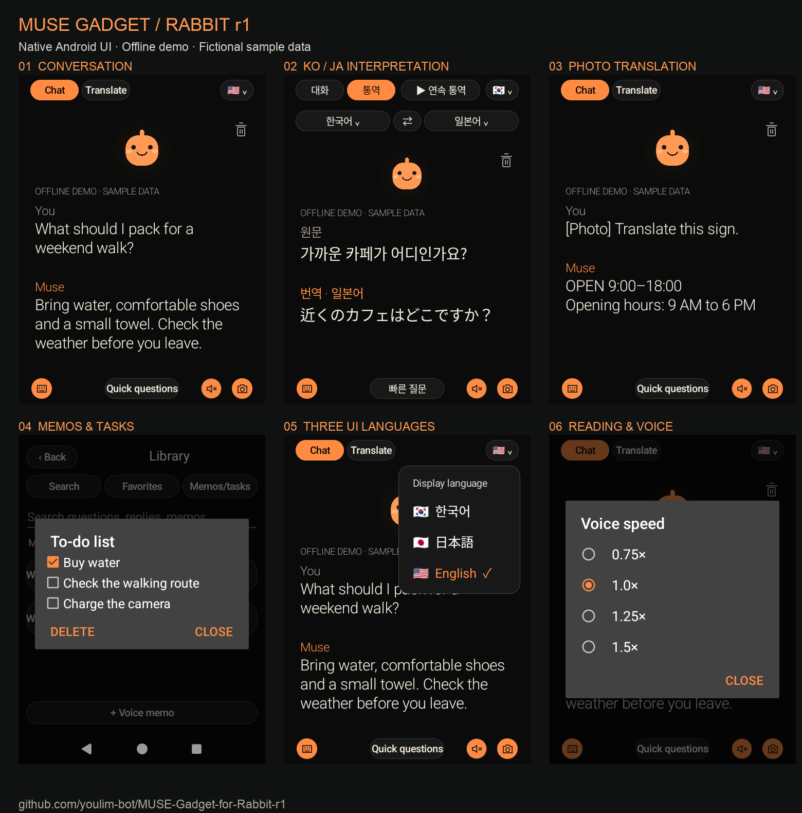

# Discord showcase

These are **real screenshots of the native Android UI**, captured on a Rabbit r1 at 480×640 using the separate offline demo build. All content is fictional. The photo translation is a prepared answer, not a live photo/model test. No account or private history was used. UI states without an in-screen demo label are still fixture screenshots; keep this description when sharing.

| Screen | PNG |
|---|---|
| English chat | [en-chat.png](images/en-chat.png) |
| Korean chat | [ko-chat.png](images/ko-chat.png) |
| Japanese chat | [ja-chat.png](images/ja-chat.png) |
| KO → JA interpretation (English UI) | [en-translate.png](images/en-translate.png) |
| KO → JA interpretation (Korean UI) | [ko-translate.png](images/ko-translate.png) |
| Photo text translation sample | [en-photo.png](images/en-photo.png) |
| Language selector | [en-languages.png](images/en-languages.png) |
| Checklist, English | [en-tasks.png](images/en-tasks.png) |
| Checklist, Korean | [ko-tasks.png](images/ko-tasks.png) |
| Reading/voice settings | [en-settings.png](images/en-settings.png) |
| Voice speed | [en-voice-speed.png](images/en-voice-speed.png) |

## English caption

I've been turning my Rabbit r1 into a Muse gadget on LineageOS, building on Cameron Pak's muse-r1 project. Added Korean/Japanese/English UI and sentence-by-sentence interpretation, optional ElevenLabs speech, photo questions and text translation, keyboard input, quiet mode, favorites/search, voice-to-text memos, checklists, and text-size/speech-speed settings.

Source, installation notes and the recovery story are available in English, Korean and Japanese:
https://github.com/youlim-bot/MUSE-Gadget-for-Rabbit-r1

Screenshots are from an offline demo with fictional data—not live AI results. Community prototype; some end-to-end flows still need testing. Credit to Cameron Pak and the r1 community. Feedback welcome!

## 한국어 게시문

Cameron Pak의 muse-r1 프로젝트를 기반으로 LineageOS를 설치한 Rabbit r1에 Muse 기능을 확장했습니다. 한·일·영 UI와 문장 단위 통역, ElevenLabs 음성 연동, 사진 질문·글자 번역, 키보드, 조용한 모드, 즐겨찾기·검색, 음성 메모·체크리스트, 글자 크기·음성 속도 설정을 추가했습니다.

소스와 설치·복구 과정을 영어·한국어·일본어로 공개했습니다.
https://github.com/youlim-bot/MUSE-Gadget-for-Rabbit-r1

첨부 화면은 더미 데이터를 사용한 오프라인 데모이며 실제 AI 응답 검증 화면은 아닙니다. 커뮤니티 프로토타입으로 일부 기능은 추가 실사용 검증이 필요합니다. 원본 개발자 Cameron Pak과 r1 커뮤니티에 감사드립니다. 의견 부탁드립니다!

## 日本語の投稿文

Cameron Pakさんのmuse-r1をベースに、LineageOSを導入したRabbit r1のMuse機能を拡張しました。韓国語・日本語・英語UIと文単位の通訳、ElevenLabs音声連携、写真への質問・文字翻訳、キーボード、サイレントモード、お気に入り・検索、音声メモ・チェックリスト、文字サイズ・音声速度設定を追加しています。

ソース、導入手順、復旧の記録を英語・韓国語・日本語で公開しました。
https://github.com/youlim-bot/MUSE-Gadget-for-Rabbit-r1

画像は架空データを使ったオフラインデモであり、実際のAI回答の検証画面ではありません。コミュニティの試作版で、一部の機能は追加の実利用検証が必要です。原作者Cameron Pakさんとr1コミュニティに感謝します。フィードバック歓迎です！
